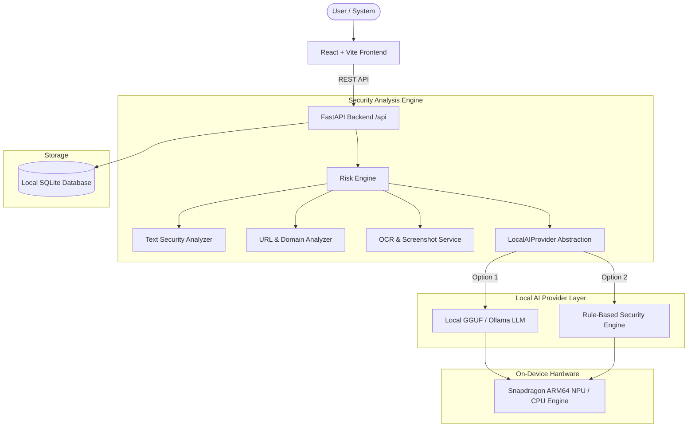

# SnapGuard AI

**"Private On-Device AI Scam & Phishing Detector"**

Developed for the **Qualcomm Snapdragon® AI Lab Build & Present Challenge**.

---

## 1. Problem Statement

Digital scam messages, phishing emails, fake job recruitment offers, parcel delivery fraud, and typosquatted banking links cause severe financial loss every day. Users often paste suspicious personal messages into cloud AI web applications, unintentionally exposing sensitive personal information, account numbers, and OTPs to remote servers.

---

## 2. Solution

**SnapGuard AI** is a privacy-first AI security assistant designed for Snapdragon-powered PCs running Windows ARM64. It analyzes suspicious text messages, screenshots, and URLs completely on-device and provides:

1. **Risk Level**: `LOW`, `MEDIUM`, `HIGH`, `CRITICAL`
2. **Risk Score**: `0–100` calibrated threat rating
3. **Detected Warning Signals**: Exact matched threat indicators with evidence snippets
4. **AI Explanation**: Clear evidence-backed reasoning
5. **Actionable Recommendations**: Step-by-step guidance on how to safely respond
6. **PDF & JSON Export**: Exportable security audit reports

---

## 3. Key Innovation

- **Privacy-First Local AI Analysis**: All core pattern recognition, domain parsing, and LLM/ONNX inference execute locally on user hardware. Zero cloud API calls required.
- **Transparent Hardware Reporting**: Real-time probe detects Windows ARM64 architecture, system RAM, CPU processor model, and Qualcomm ONNX QNN execution providers without fabricating NPU claims.
- **Multimodal Evidence Engine**: Text analysis + Screenshot OCR extraction + URL typosquatting breakdown.

---

## 4. System Architecture



---

## 5. Tech Stack

- **Frontend**: React 18, Vite, TypeScript, Tailwind CSS, Lucide React icons, Recharts.
- **Backend**: Python, FastAPI, Pydantic, Uvicorn, SQLite database.
- **AI & OCR**: LocalAIProvider abstraction, PyTesseract / EasyOCR, Ollama / llama.cpp HTTP client.
- **Reporting**: ReportLab PDF exporter.

---

## 6. Installation (Windows)

### Step 1: Set Up Backend Virtual Environment
```powershell
cd backend
python -m venv .venv
.venv\Scripts\activate
pip install -r requirements.txt
```

### Step 2: Set Up Frontend Dependencies
```powershell
# Open a second terminal window
cd frontend
npm install
```

---

## 7. Running the Application

### Start FastAPI Backend
```powershell
# In backend directory with .venv active:
python run.py
```
Backend starts on `http://127.0.0.1:8000`.

### Start React Frontend
```powershell
# In frontend directory:
npm run dev
```
Frontend web dashboard will open on `http://localhost:3000`.

---

## 8. Running Automated Test Suite

```powershell
# From project root directory with .venv active:
pytest tests/
```

Included unit tests cover:
- 10+ Risk Engine scoring scenarios (`LOW`, `MEDIUM`, `HIGH`, `CRITICAL`)
- 5+ URL analyzer heuristic cases (IP host, shorteners, brand typosquatting, punycode)
- API endpoint integration tests (`/api/health`, `/api/system/status`, `/api/analyze/message`, `/api/history`)
- Hardware detection schema & non-faking verification

---

## 9. Local AI Setup Instructions

SnapGuard AI features a pluggable `LocalAIProvider` abstraction:

1. **Option A: Automated Rule-Based Fallback (Zero Config)**  
   No model weights required. Built-in deterministic security reasoning engine provides instant local analysis out of the box.

2. **Option B: Local Ollama / GGUF LLM**  
   - Install [Ollama](https://ollama.com) or `llama.cpp`.
   - Run `ollama run llama3:8b` or `ollama run phi3:mini`.
   - SnapGuard AI automatically connects to `http://localhost:11434` and uses local GGUF weights.

---

## 10. Qualcomm Snapdragon® ARM64 Deployment

- **x86 Independence**: Pure portable Python & JavaScript libraries. Avoids x86-only C extensions.
- **Qualcomm QNN Readiness**: Probes for ONNX Runtime `QNNExecutionProvider` DLLs. When detected on Snapdragon PCs, offloads matrix multiplication directly to Qualcomm Hexagon NPUs.

---

## 11. Privacy Assurance

- **Zero Cloud Uploads**: Message content is processed in local RAM.
- **Opt-In Content Retention**: By default, raw analyzed content is **NOT** stored in the local SQLite database. Only anonymous risk metadata is retained.

---

## 12. Limitations & Transparency

- **AI Model Safety**: Risk scores are heuristic indicators designed to aid user vigilance, not absolute guarantees.
- **Rule Engine Scope**: Rule-based detection relies on known pattern taxonomies; new emerging threat vectors may require pattern updates.
- **Hardware Acceleration**: NPU acceleration is displayed as active **only** when verified ONNX Runtime QNN drivers are present.
