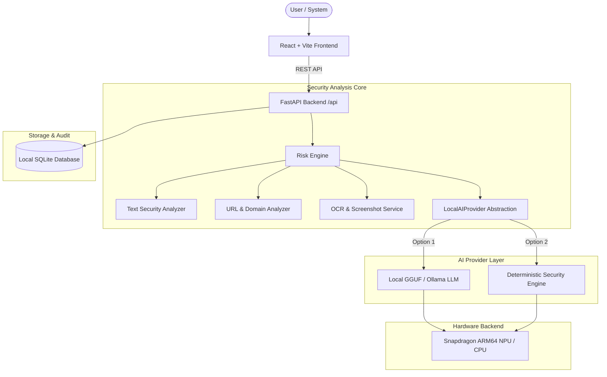

# SnapGuard AI - System Architecture

SnapGuard AI is built around a privacy-first, zero-cloud-dependency security analysis pipeline.

## Modular Components
1. **Frontend**: React 18, TypeScript, Tailwind CSS, Lucide icons.
2. **Backend**: FastAPI, Pydantic, Uvicorn, SQLite database.
3. **Risk Scoring Engine**: Calibrated 0–100 threat engine combining regex security indicators, typosquatting domain analysis, punycode detection, and AI explanations.
4. **Local AI Provider Abstraction**: Interfaces with local GGUF models or high-speed rule engines.
5. **Hardware Probing**: Real-time detection of Windows ARM64 platform, RAM, CPU model, and Qualcomm ONNX QNN execution providers.
